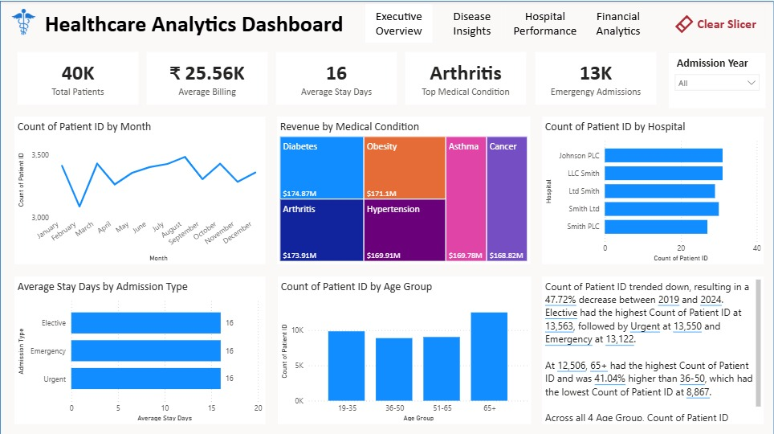
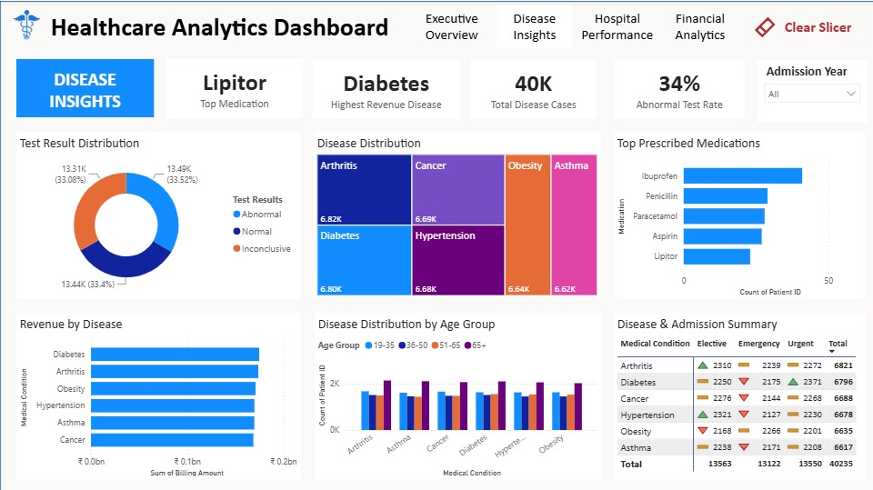
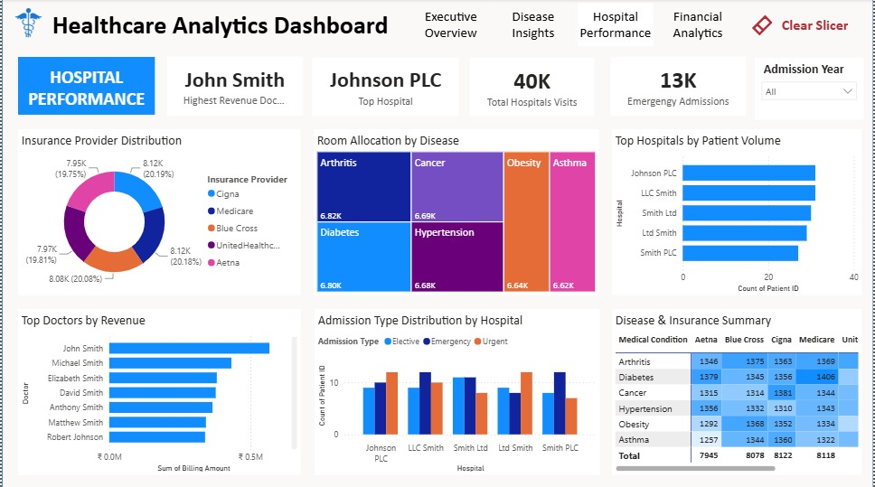
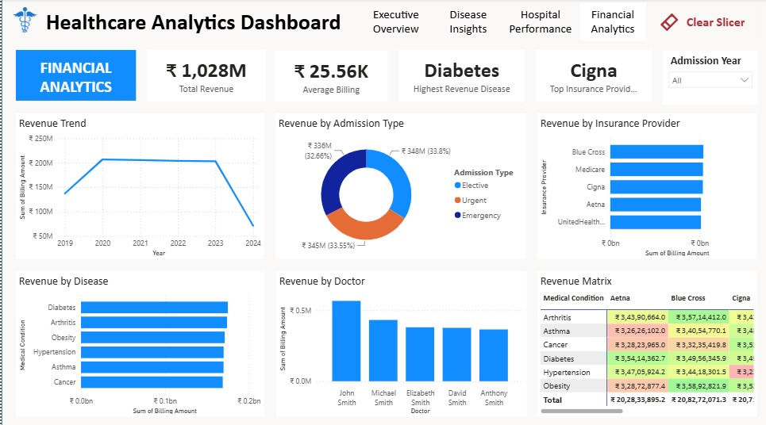

# Healthcare Analytics Dashboard (Power BI)

## Project Overview

The **Healthcare Analytics Dashboard** is an interactive dashboard developed using **Microsoft Power BI** to analyze healthcare data and provide meaningful insights into hospital performance, disease trends, financial metrics, and patient records.

## Objectives

- Analyze hospital performance.
- Monitor disease statistics.
- Evaluate financial performance.
- Provide interactive healthcare insights.

## Technologies Used

- Microsoft Power BI
- Power Query
- DAX
- Data Modeling
- Drill-through
- KPIs

## Dashboard Pages

### Executive Overview

Provides an overall summary of healthcare KPIs and performance metrics.

### Disease Insights

Analyzes disease distribution, treatment trends, and patient statistics.

### Hospital Performance

Monitors hospital efficiency, patient admissions, and operational performance.

### Financial Analytics

Visualizes revenue, expenses, and financial KPIs.

## Repository Contents

| File | Description |
|------|-------------|
| Healthcare_Analytics_Dashboard.pbix | Power BI project |
| Executive_Overview.png | Dashboard preview |
| Disease_Insights.png | Dashboard preview |
| Hospital_Performance.png | Dashboard preview |
| Financial_Analytics.png | Dashboard preview |
| README.md | Project documentation |

## Author

**Iqra Shaikh**

Data Science | Data Analytics | AI/ML
